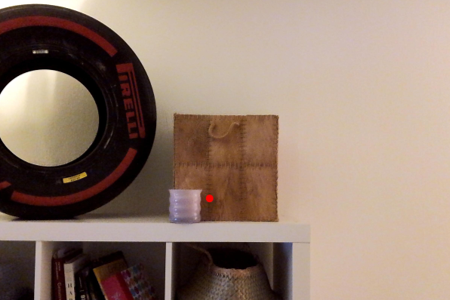

# Eyemantics - Eyetracking Semantics
[Demo Video](https://www.youtube.com/watch?v=6OB_NjEuclw) | [Report](./docs/EyemanticsReport.pdf)

This work is driven by the goal of extending the usability of advanced image segmentation methods through Mixed Reality (MR) technology for immersive and interactive user experience. We explore the integration of advanced 2D image segmentation techniques with the Magic Leap 2 (ML2) headset to achieve real-time 3D instance segmentation in mixed reality (MR) environments. The pipeline comprises image capture, gaze point analysis, image conversion, and projection, facilitated by a robust TCP communication channel between the ML2 and a processing PC. We employ the Segment Anything Model (SAM) to efficiently process segmentation tasks.

    

## Authors
- [Wenqian Yang](https://github.com/wenqian157)
- [Marino Müller](https://github.com/marinom27)
- [Joram Eickhoff](https://github.com/JoramEickhoff)
- [Elisa Hoskovec](https://github.com/ehosko)

## Unity Application on the ML2 Headset

### Prerequisites
- [Unity 2023.3.10f1](https://unity.com/download)
- [Magic Leap Hub](https://ml2-developer.magicleap.com/downloads)

### Magic Leap Hub
Install the Unity bundle through the package manager in the ML Hub. Make sure to also include the "Magic Leap Simulator for Unity".

### Build the Unity Project
Open the ``EyemanticsUnity`` project with the editor version 2023.3.10f1. 

Upon opening the project, a warning for a missing file regarding the ML simulator for Unity migth pop up. Enter the project in safe mode, it can be fixed easily.
Once in safe mode, go to ``Window > Package Manager > Add package from tarball`` and navigate to your previously installed ``com.magicleap.appsim.tgz``, the package for the "Magic Leap Simulator for Unity".
You can find the path through the package manager in ML Hub. Navigate to "My Tools" and select "Open Folder" for the "Magic Leap Simulator for Unity". ``com.magicleap.appsim.tgz`` is located here.

Once the issue is resolved, the Magic Leap Set up Tool might pop up. Simply click "apply all" to apply all necessary changes. Now you can build the application. Make sure to include the scenes ``OpeningScene`` and ``GazeAndMeshing`` for the complete app.

### Run the Unity App on the ML2 Headset
After building the project, install it on the Magic Leap through the device bridge in ML Hub and run the app on the ML2 headset. 

At first, the IP address will be prompted, which you need as an input for the Python script. As soon as the Python script is connected, the sign will disappear and the app is ready for segmentation. 

To segment an object, look at it and click the lower button on the back of the ML2 controller. Depending on the segmentation speed on your PC, a red mask will be overlaid on the object a few seconds later. You can repeat this process arbitrarily many times. The upper button on the back of the controller enbales and disables the mesh.

## Python Script on the PC handling SAM and the TCP Client

### Prerequisites
SAM requires ``python>=3.8``, and ``pytorch>=1.7`` and ``torchvision>=0.8``. For the latter please visit [pytorch](https://pytorch.org/get-started/locally/).
Afterward, you can install the rest of the requirements via ``pip install -r requirements.txt``. 
Lastly, move into the ``./weights`` folder and download the weights according to the instructions.

### Run the Python Script
To start the TCP client and execute the segmentation run

    python SAM.py
    
in the ``EyemanticsML`` folder. Make sure to have the Unity app on the Magic Leap open, it will prompt you the IP address, which you need to connect to the device. The Python script will ask you for the IP address as input.
If you have a GPU available, change the specified line (line 26) in ``SAM.py`` to ``"cuda"`` to drastically speed up the mask generation.
